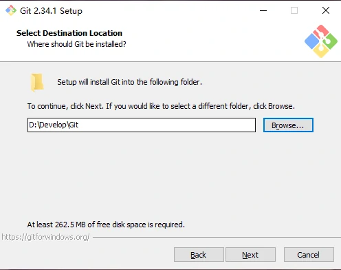
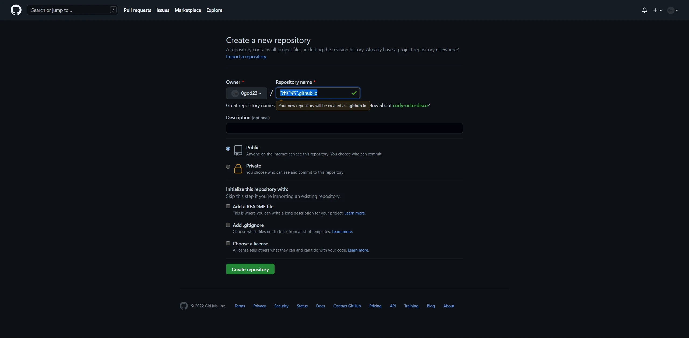
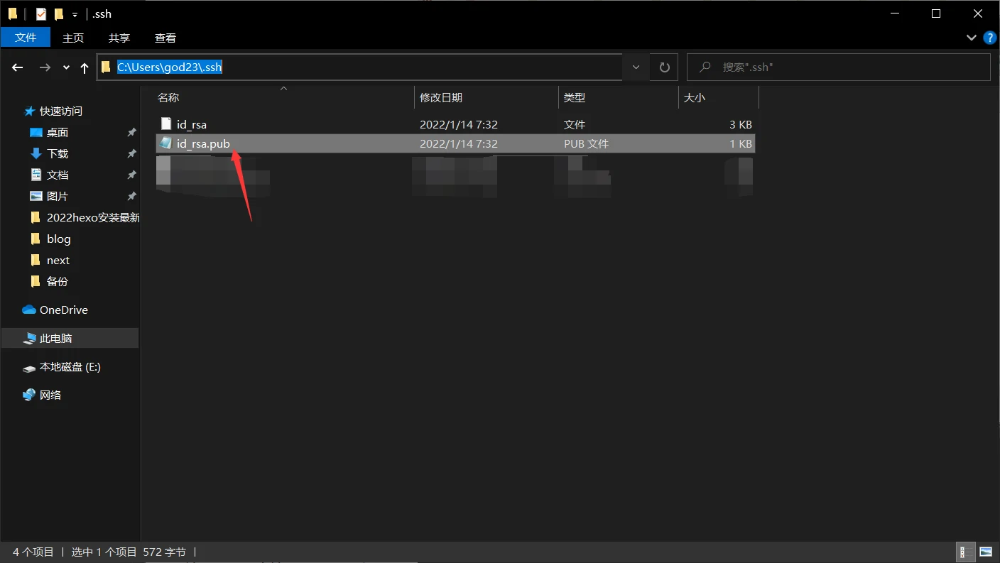
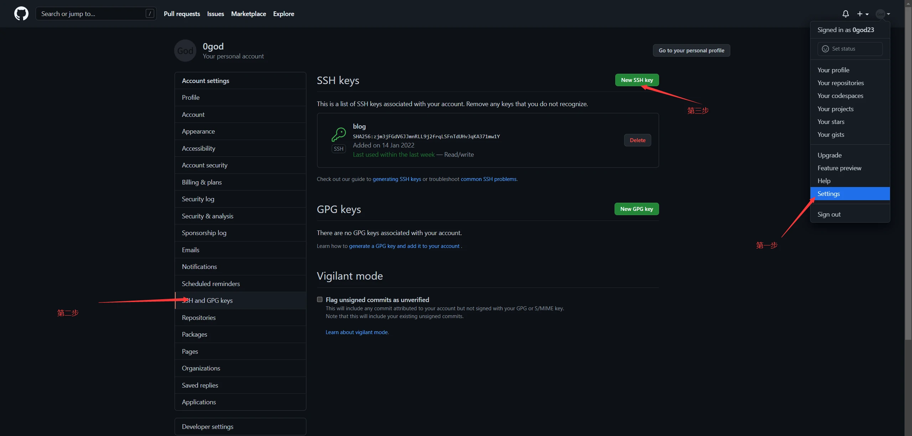
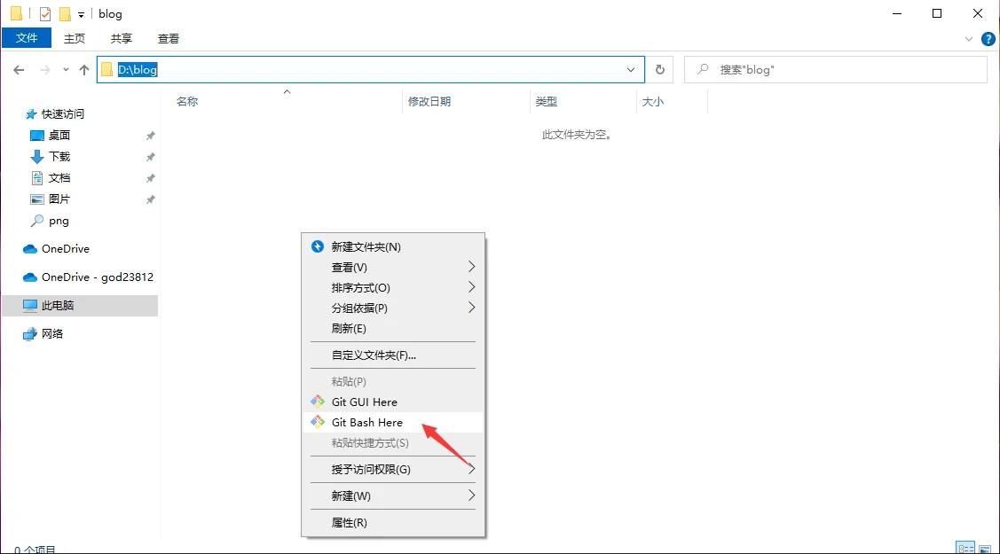
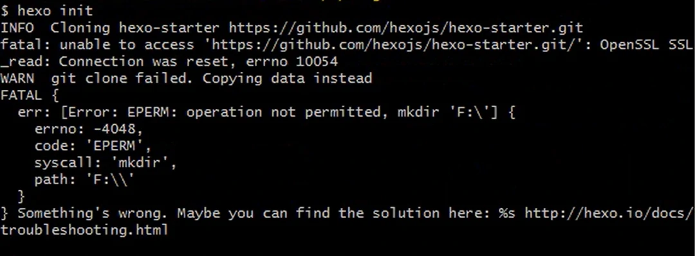
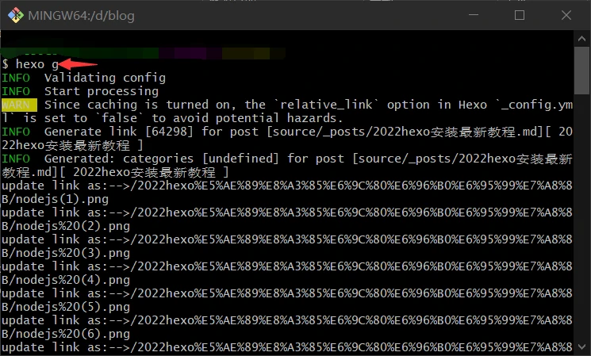
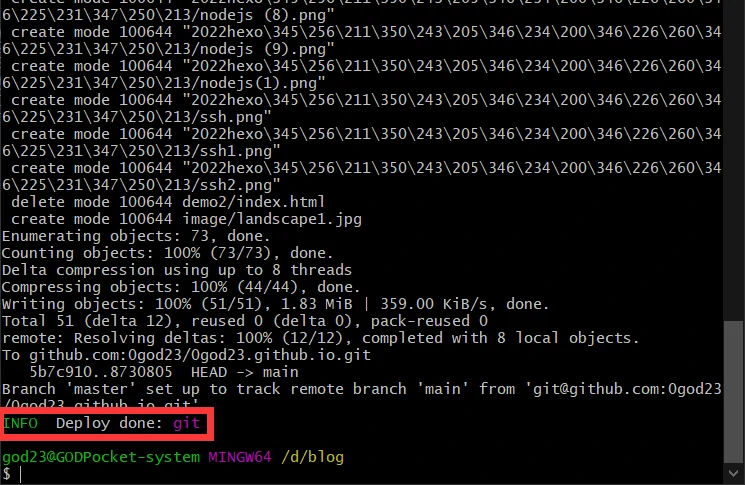

hexo博客安装全过程
<!-- more -->

>安装包版本如下：
NodejsLTS16.13.2
Git2.35.0


#### nodejs安装

---


1.双击安装包
.webp)
2.Next
.webp)
3.修改安装目录为
```
D:\Develop\nodejs\
```
.webp)
4.Next
.webp)
5.Next
.webp)
6.Install
.webp)
7.Finish
.webp)
8.打开命令提示符cmd
.webp)
9.分别输入以下指令检测是否安装成功
```
node -v
npm -v
```
.webp)
10.进入安装目录
.webp)
11.在nodejs文件夹内创建两个以下名称的文件夹
```
node_global
node_cache
```
.webp)
12.创建完成后打开cmd指令分别输入以下两条指令
```
npm config set prefix "D:\Develop\nodejs\node_global"
npm config set cache "D:\Develop\nodejs\node_cache"
```
.webp)
13.配置环境变量，“我的电脑➡右键➡属性➡高级系统设置➡高级➡环境变量”
.webp)
14.用户变量下的path修改为
```
D:\Develop\nodejs\node_global
```
.webp)
.webp)
.webp)
15.新建一个系统变量名称为
```
NODE_PATH
```
变量值为
```
D:\Develop\nodejs\node_global\node_modules
```
.webp)
#### git安装

---
1.打开安装包，next
2.选择安装目录(目录在哪无所谓，本人多少有点大冰，新建太多文件夹难受，所以就都放在Develop文件夹,当然,你随意)

3.Next直到结束
4.Finish安装完成
#### 通过ssh keys绑定GitHub
1.注册GitHub
提示填啥就填啥，注册个账户
2.登录进去以后，点击new，新建一个仓库

存储库名称格式必须为
```
"username".github.io   ["username"是自己的用户名]
```

3.打开cmd，执行以下指令生成ssh key
```
ssh-keygen -t rsa -C "username@email.com"   ["username@email.com"是github绑定的邮箱]
```
回车直到生成
密钥生成的目录为
```
C:\Users\"username"\.ssh
```

4.通过记事本或者编辑器打开
摁下[ctrl + a]全选，复制
打开GitHub并登录，点击头像➡Settings➡SSH and GPG keys➡New SSH key

5.绑定ssh keys
>title随便写
Key将刚才复制的密钥粘贴进去
点击Add SSH Key

6.在命令提示符cmd中原封不动输入以下指令
```
ssh -T git@github.com
```
若回复为Hi "你的GitHub用户名"则为绑定成功

7.配置git，在cmd下输入以下命令
```
git config --global user.name "username"   ["username"是自己的用户名]
git config --global user.email "username@email.com"   ["username@email.com"是github绑定的邮箱]
```
#### hexo安装
1.以管理员身份打开cmd，执行hexo全局安装指令
```
npm install hexo-cli -g
```
2.输入以下指令检测hexo是否安装成功
```
hexo -v
```
3.在D盘新建一个[blog]文件夹,并进入
4.在blog文件夹下，右键➡Git Bash Here,进入命令行工具

5.输入初始化命令
```
hexo init
```

>这里非常容易报错，只要之前步骤没有任何改动，那么这里报错百分之九十是网络问题。
解决方案1：清除缓存，多试几次
解决方案2：用"科学"或者"魔法"

6.以下为初始化成功提示

7.打开blog文件夹下的"_config.yml"hexo配置文件，拉到最底部
```
deploy:
  type: git
  repo: git@github.com:0god23/0god23.github.io.git
  branch: main
```

>": "后边均有一个空格，请不要删除

>repo: 请修改为自己创建的GitHub仓库的ssh url克隆链接
如图


8.执行[hexo g]生成本地静态文件

9.执行以下命令安装 hexo-deplayer-git 依赖
```
npm install hexo-deployer-git --save
```
10.执行[hexo d]部署到GitHub仓库，这里会有一个弹窗提示登陆github账号，登录即可

11.稍等几分钟即可部署生效
访如下网址
```
username.github.io   ["username"是自己的用户名]
```
# ~~end~~